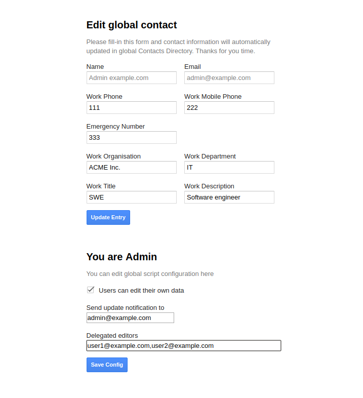

# Edit G Suite Directory Contacts

Allow your G Suite users or delegated editors to edit Google directory contact records

---

 * author Misha M.-Kupriyanov https://google.com/+MishaMKupriyanov
 * This repo  https://github.com/printminion/GoogleAppsScript/tree/master/EditDirectoryContacts
 * Copy of this script https://script.google.com/d/10nsoJksf98pEY5W-algHxyFKEDAEulo7H_2JUbKCNeRYmnzg9wNrtSqB/edit?usp=sharing
---

1. Enable "Admin Directory API" in Resources -> "Advanced Google Services"
2. Enable "Admin SDK" in "Developer Console Project" -> "*-project-id-*"-Link
3. Run the initialize method
4. Create new project version
5. Open WebApp URL

